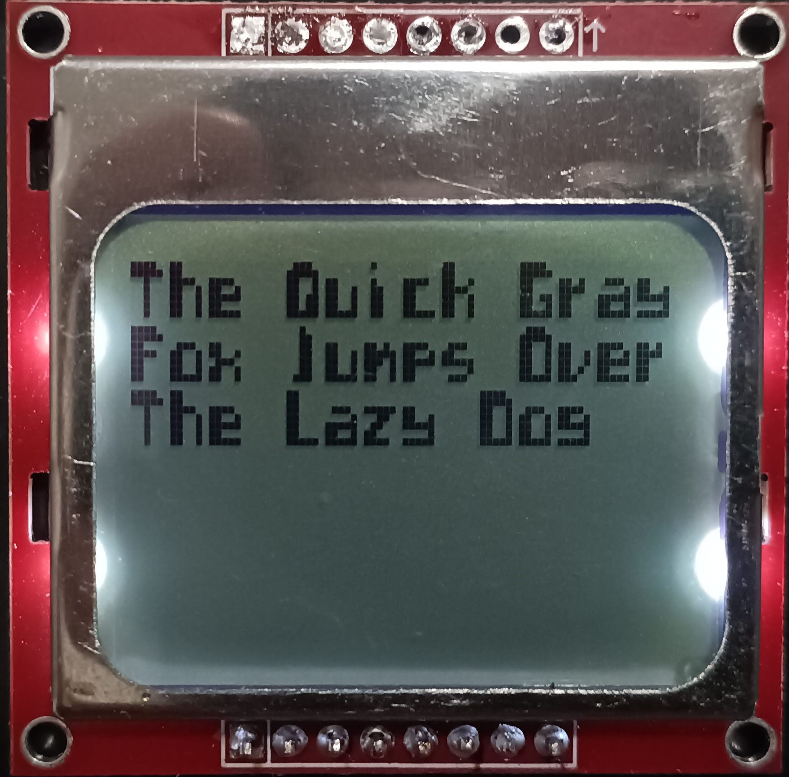
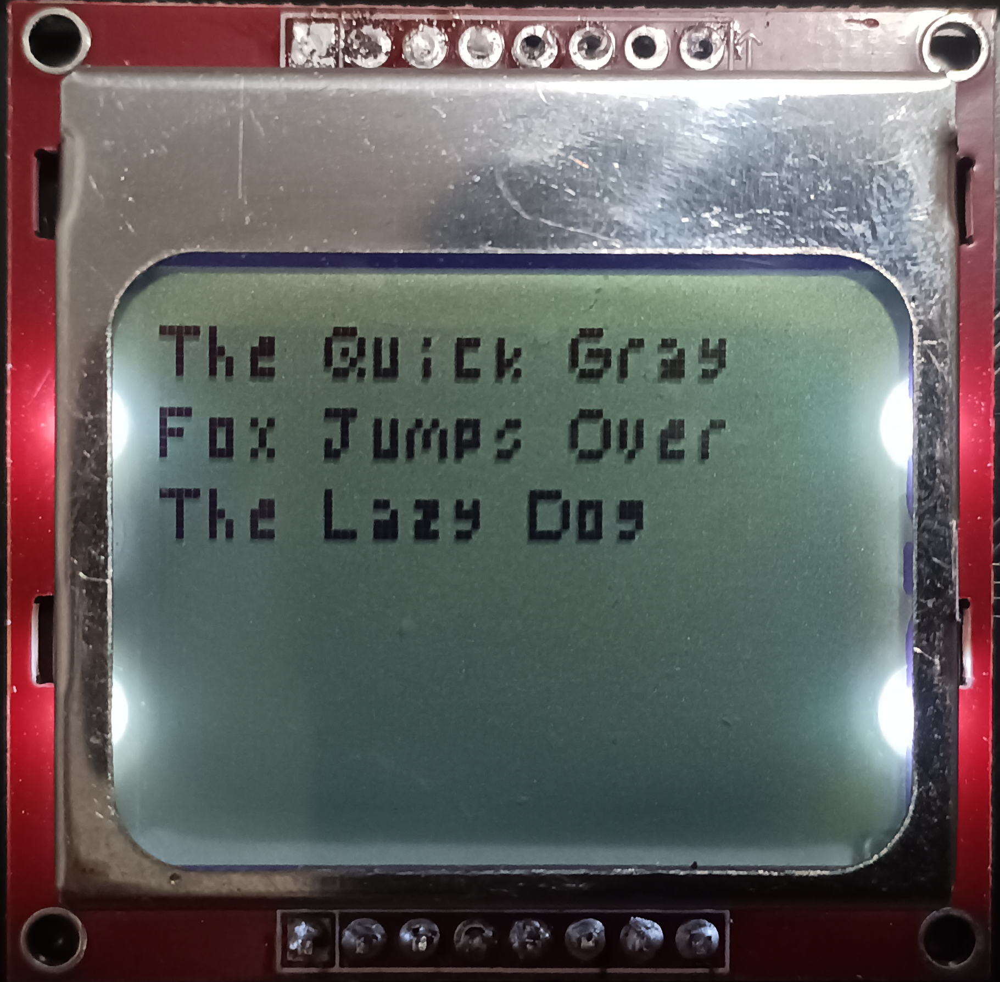
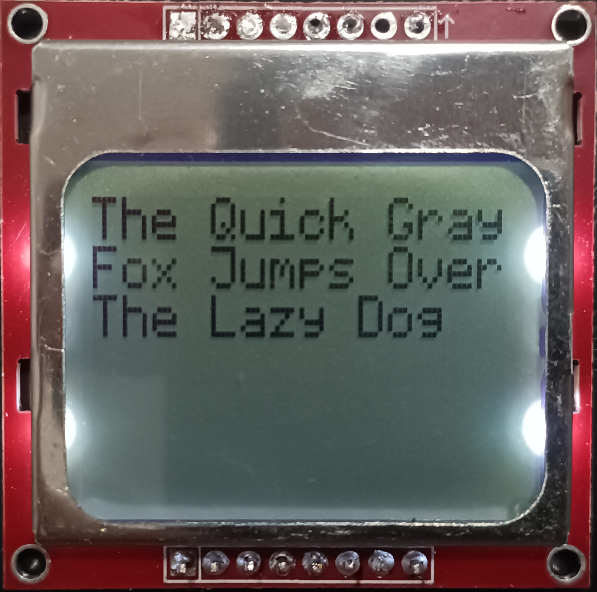
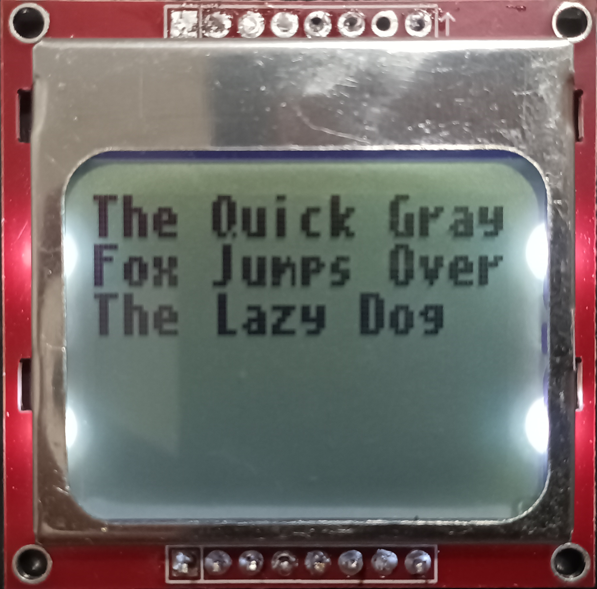
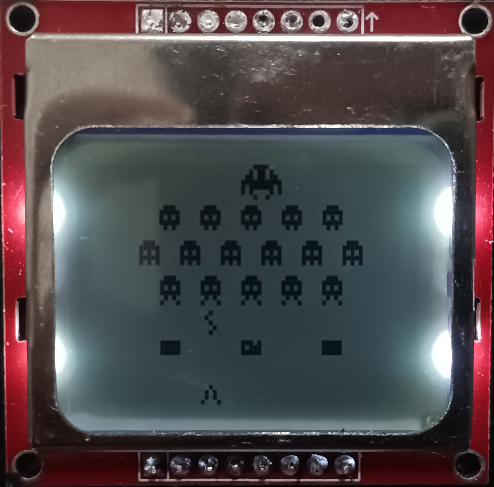

# Micropython Fontlib
A simple micropython library that adds 5 different fonts to it, I made it for a monocrome screen (pcd8544 nokia screen)  but you should be able to easily modify it for color screens 

# How to use it
add fontlib.py and fonts_dictionary.py to your micropython device, then use the library to modify a framebuffer:
```python
import framebuf
import fontlib

screen_width = 85
screen_height = 85
spce = 1 # characters spacing
pos_x = 0 # X position on the frame buffer to print the text
pos_y = 0 # Y position on the frame buffer to print the text

buffer = bytearray((screen_height // 8) * screen_width)
fbuf = framebuf.FrameBuffer(buffer, screen_width, screen_height, framebuf.MONO_VLSB)
fbuf.fill(0)
fontlib.printstring("The Quick Gray",pos_x,pos_y,spce,fbuf,font_name = "futuristic")
```
see the examples folder for a exemple on how to use it with a Nokia 5110 LCD Display

# How create new fonts
add a bitmap font, and rename it similary to the others in the Bitmaps folder then run the 'BitmapDictionaryGenerator.ipynb' python notebook

# TODO
- [x] Load fonts directly from 1bit bitmaps
- [ ] Support for portuguese special characters (ç,á,é,í,ó,ú,â,ê,ô,ã,õ)(Ç,Á,É,Í,Ó,Ú,Â,Ê,Ô,Ã,Õ).
- [ ] Support for color screens
  
# Available fonts:
[futuristic](https://opengameart.org/content/ascii-bitmap-font-futuristic) :\

\
five:\

\
[oldschool](https://opengameart.org/content/ascii-bitmap-font-oldschool) :\

\
[cellphone](https://opengameart.org/content/ascii-bitmap-font-cellphone) :\

\
icons:\


