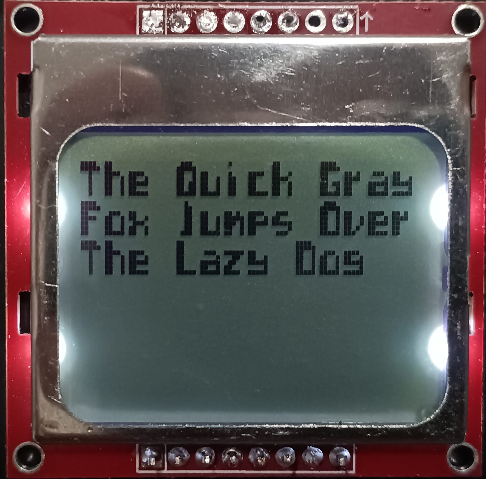
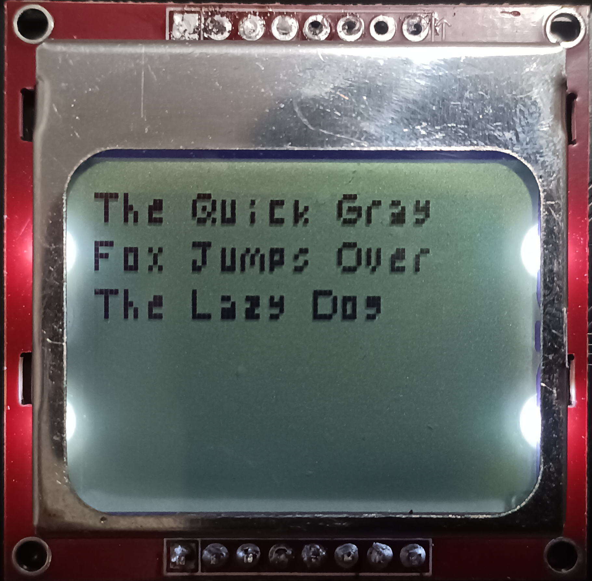
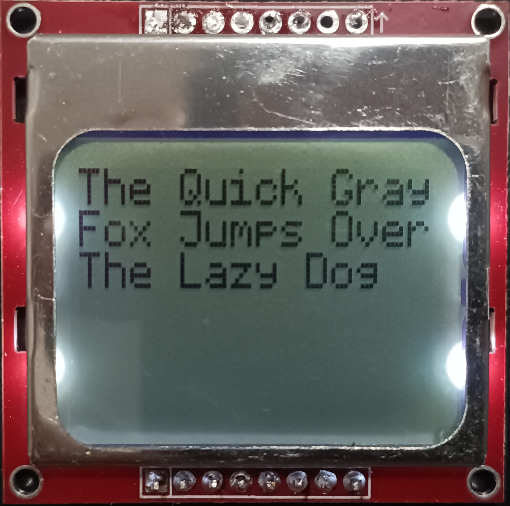
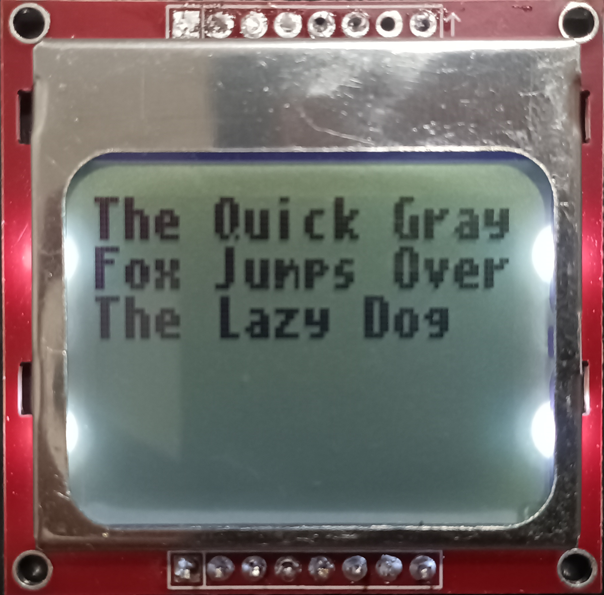
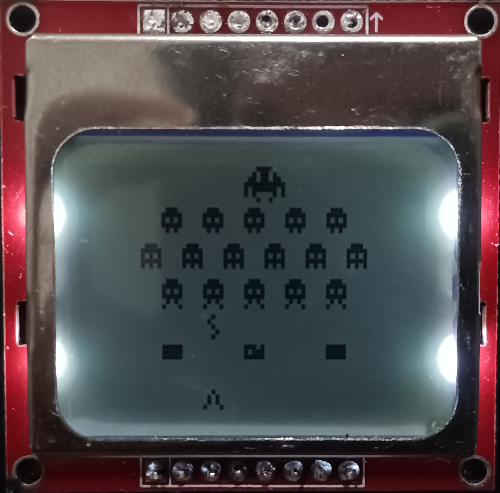

# Micropython Fontlib
A simple micropython library for using 1bit bitmaps as fonts, I made it for a monocrome screen (pcd8544 nokia screen)  but you should work with any monocrome screens through [framebuffer](https://docs.micropython.org/en/latest/library/framebuf.html)

# How to use it
Add fontlib.py and a 1bit font .bmp (should follow the same formatting of the bmp files on the Bitmaps folder) file to your micropython device, then use the library to modify a framebuffer:
```python
import framebuf
import fontlib

screen_width = 85
screen_height = 85
spce = 1 # characters spacing
pos_x = 0 # X position on the frame buffer to print the text
pos_y = 0 # Y position on the frame buffer to print the text

five = fontlib.font("five (5,5).bmp") # Loads font to ram 

buffer = bytearray((screen_height // 8) * screen_width)
fbuf = framebuf.FrameBuffer(buffer, screen_width, screen_height, framebuf.MONO_VLSB)
fbuf.fill(0)
fontlib.prt("The Quick Gray",0,0,1,fbuf,five) # prints text using font
```
see the examples folder for a exemple on how to use it with a Nokia 5110 LCD Display

# How create new fonts
Most image editors should be able to save files to 1bit bmp, I recommend [paint.net](https://www.getpaint.net/), draw 1 pixel padding around each letters, the file name should include the character size, like the fonts in the fonts folder. on paint.net if you "save as" and choose bmp it will prompt you with "saving configuration" choose the 1bit option. 

# TODO
- [x] Load fonts directly from 1bit bitmaps
- [x] Support for portuguese special characters (ç,á,é,í,ó,ú,â,ê,ô,ã,õ)(Ç,Á,É,Í,Ó,Ú,Â,Ê,Ô,Ã,Õ).
- [ ] Support for color screens

# Available fonts:
[futuristic](https://opengameart.org/content/ascii-bitmap-font-futuristic) :\

\
five:\

\
[oldschool](https://opengameart.org/content/ascii-bitmap-font-oldschool) :\

\
[cellphone](https://opengameart.org/content/ascii-bitmap-font-cellphone) :\

\
icons:\



# LICENSE:
this project is [MIT licensed](https://github.com/Rumidom/micropython_fontlib/blob/main/LICENSE)
